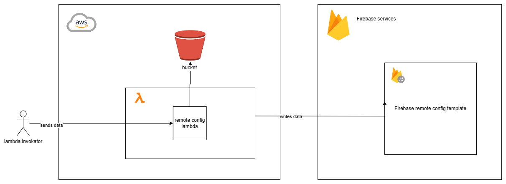

# Demo summary

What is this sample about ?

The sample consist in the creation of a lambda  (AWS) function that can receive an event thorugh http invocation (not all lambda events supported yet)
which will contain a property name and value that will be exported to firebase remote config using oauth2 client and the recommended approach in the google documentation

## Other services recommended

- S3 is used to save service-account to connect to google. It can be secure according your permissions and how you can deploy the secret for the lambda. If you already have secrets manager or parameter store will be better you edit the way this code downloads the service account to follow your own security mechanism. 

- EC2 if by any chance you include more libraries you can use an EC2 image to deploy lambda functions invoking a lambda container https://docs.aws.amazon.com/lambda/latest/dg/python-image.html#python-image-instructions

- Deployment: using SAM (like this example) is NOT mandatory to deploy this code. You can use CDK, Terraform, Serverless framework or another tool if it's the tool in place for your internal pipelines. 

# Getting started

## Option 1

- Use dev containers in vscode or your IDE and create a file called 'devcontainer.json' inside '.devcontainer'. You can copy the file inside .devcontainer folder called 
devcontainer.example.json to get started. 
- Open the vs studio command pallete and select 'Dev contaiers: rebuild and open' 

## Option 2

Use directly docker-compose and you will be able to open and join to the container cli of the container called 'python_container' such as
docker exec -it <container-id-or-name> /bin/bash

## Why do you need to get into the container ? 

You actually don't do get into the container command line but the docker image that it's built by Dockerfile.dev file has some clis you can use to avoid install this dependencies in your local machine.   If you already have aws, sam and python dependencies you can avoid to the containers but it's highly recommended

# Create layer

go to layer folder and run

pip install -r requirements.txt -t python/

then run the commands in the next section

# Deploy lambda function manually

sam package --template-file template.yaml --output-template-file packaged.yaml --s3-bucket your-s3-bucket-name
sam deploy --template-file packaged.yaml --stack-name labmda-remote-config-stack --capabilities CAPABILITY_IAM

# Documentation

https://firebase.google.com/docs/remote-config/automate-rc?hl=en
https://github.com/firebase/quickstart-python/tree/master/config
